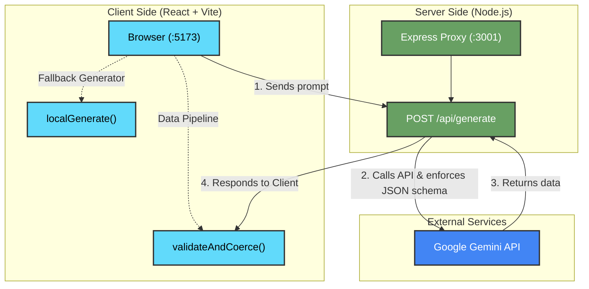

# 🎓 Study Assistant

An AI-powered study tool that transforms your notes into interactive flashcards and quizzes. Built with React + Vite and backed by Google's Gemini API.


## 📋 Table of Contents

- [✨ Features](#-features)
- [🚀 Quick Start](#-quick-start)
- [🏗️ Architecture](#️-architecture)
- [📁 Project Structure](#-project-structure)
- [🧪 Testing Chaos Mode](#-testing-chaos-mode)
- [⌨️ Keyboard Shortcuts](#️-keyboard-shortcuts)
- [📜 Scripts](#-scripts)
- [📄 License](#-license)

## ✨ Features

- **🎴 Smart Flashcards** — AI-generated Q&A cards with 3D flip animation, optional images, and confidence tracking (Got it / Need Review)
- **📝 Multi-Format Quizzes** — Multiple-choice and True/False questions with instant feedback and explanations
- **🌪️ Chaos Mode** — Intentionally mangles AI responses to demonstrate that the UI never crashes on bad data
- **📚 Study History** — Auto-saves every session to localStorage; reload past materials with one click
- **📊 Stats Dashboard** — Track sessions, cards generated, and study activity over time
- **📥 Markdown Export** — Download flashcards and quizzes as a clean `.md` file, including confidence ratings
- **⌨️ Keyboard Shortcuts** — `Ctrl+Enter` to generate, `Ctrl+E` to export, arrow keys to navigate
- **🌙 Dark Mode** — Full dark theme with smooth transitions

## 🚀 Quick Start

```bash
# Install dependencies
npm install

# Add your Gemini API key
echo 'GEMINI_API_KEY="your-key-here"' > .env

# Start both frontend + backend
npm start
```

Open [http://localhost:5173](http://localhost:5173) and paste your notes!

> **No API key?** The app falls back to a deterministic on-device generator, so you can still test every feature.

## 🏗️ Architecture



### Three Layers of Defense Against Bad AI Output

1. **Schema Enforcement** — Gemini's `responseSchema` forces structured JSON at the model level
2. **Validation & Coercion** — `validateAndCoerce()` drops invalid items, preserves valid ones, and surfaces rejection notes
3. **Deterministic Fallback** — `localGenerate()` produces usable study materials from raw text if the API fails entirely

## 📁 Project Structure

```
├── server.js                    # Express proxy + Gemini SDK + Chaos Mode
├── .env                         # GEMINI_API_KEY (gitignored)
├── vite.config.js               # Dev server + /api proxy
├── src/
│   ├── App.jsx                  # Main app, reducer, keyboard shortcuts
│   ├── index.css                # Full design system (glassmorphism, 3D flip, animations)
│   ├── utils/
│   │   └── ai.js                # API calls, validation, fallback generator
│   └── components/
│       ├── States.jsx           # Idle, Loading, Error UI states
│       ├── Flashcards.jsx       # Flip cards + images + confidence rating
│       ├── Quiz.jsx             # Multiple-choice + True/False
│       ├── Results.jsx          # Score breakdown + confetti animation
│       ├── History.jsx          # Session history (localStorage)
│       └── Dashboard.jsx        # Stats + activity chart
```

## 🧪 Testing Chaos Mode

Check the **Chaos Mode** checkbox and hit Generate. The backend will randomly:
- Return a `503 Gateway Timeout` (non-JSON)
- Return valid JSON with the completely wrong schema
- Return mostly valid data with random missing fields

The UI catches all of these, drops invalid items, preserves what it can, and shows a friendly rejection note — **it never crashes**.

## ⌨️ Keyboard Shortcuts

| Shortcut | Action |
|----------|--------|
| `Ctrl + Enter` | Generate study materials |
| `Ctrl + E` | Export to Markdown |
| `←` / `→` | Navigate quiz questions |
| `Space` / `Enter` | Flip flashcard (when focused) |

## 📜 Scripts

| Command | Description |
|---------|-------------|
| `npm start` | Start both frontend + backend |
| `npm run dev` | Start Vite dev server only |
| `npm run server` | Start Express proxy only |
| `npm run build` | Production build |


