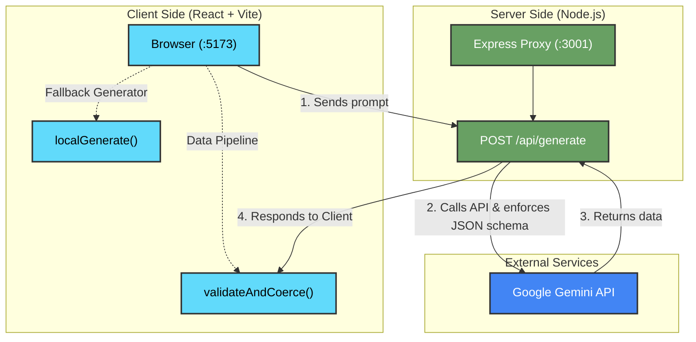

# 🎓 Study Assistant

[🎥 Watch the Demo Video](https://drive.google.com/file/d/1bxxTIS13AWW-yaTHwz378U3hifOW0I_k/view?usp=sharing)

Open [Live Demo](https://study-assistant-theta.vercel.app/) in your browser.

An AI-powered study tool that transforms your notes into interactive flashcards and quizzes. Built with React + Vite and backed by Google's Gemini API, demonstrating robust error handling, generative AI integration, and clean UI/UX design.


## 📋 Table of Contents

- [✨ Features](#-features)
- [🛠️ Tech Stack](#️-tech-stack)
- [🏗️ Architecture](#️-architecture)
- [📁 Project Structure](#-project-structure)
- [🚀 Quick Start](#-quick-start)
- [💡 Usage](#-usage)
- [🧠 Key Design Decisions](#-key-design-decisions)
- [⌨️ Keyboard Shortcuts](#️-keyboard-shortcuts)
- [📜 Scripts](#-scripts)
- [📄 License](#-license)

## ✨ Features

| Feature | Description |
|---------|-------------|
| **Smart Flashcards** | AI-generated Q&A cards with 3D flip animation, optional images, and confidence tracking. |
| **Multi-Format Quizzes** | Multiple-choice and True/False questions with instant feedback and explanations. |
| **Chaos Mode** | Intentionally mangles AI responses to demonstrate that the UI never crashes on bad data. |
| **Study History** | Auto-saves every session to localStorage; reload past materials with one click. |
| **Stats Dashboard** | Track sessions, cards generated, and study activity over time. |
| **Markdown Export** | Download flashcards and quizzes as a clean `.md` file, including confidence ratings. |
| **Dark Mode** | Full dark theme with smooth transitions. |

## 🛠️ Tech Stack

| Component | Technology |
|-----------|------------|
| **Frontend Framework** | React 19 + Vite |
| **Styling** | Tailwind CSS + Framer Motion |
| **Backend Proxy** | Node.js + Express |
| **AI Integration** | Google Gemini API (`gemini-2.5-flash`) |
| **Icons** | Lucide React |

## 🏗️ Architecture



## 📁 Project Structure

```text
├── server.js                    # Express proxy + Gemini SDK + Chaos Mode
├── .env                         # GEMINI_API_KEY (gitignored)
├── vite.config.js               # Dev server + /api proxy
├── src/
│   ├── App.jsx                  # Main app, reducer, keyboard shortcuts
│   ├── index.css                # Full design system (glassmorphism, 3D flip)
│   ├── utils/
│   │   └── ai.js                # API calls, validation, fallback generator
│   └── components/
│       ├── States.jsx           # Idle, Loading, Error UI states
│       ├── Flashcards.jsx       # Flip cards + images + confidence rating
│       ├── Quiz.jsx             # Multiple-choice + True/False
│       ├── Results.jsx          # Score breakdown + confetti animation
│       ├── History.jsx          # Session history (localStorage)
│       └── Dashboard.jsx        # Stats + activity chart
```

## 🚀 Quick Start

### Prerequisites
- Node.js 18+
- npm or yarn

### Installation & Run

```bash
# Install dependencies
npm install

# Add your Gemini API key
echo 'GEMINI_API_KEY="your-key-here"' > .env

# Start both frontend + backend concurrently
npm start
```


> **No API key?** The app falls back to a deterministic on-device generator, so you can still test every feature without setting up Gemini.

## 💡 Usage

1. **Input Notes:** Paste your study material into the main text area.
2. **Select Mode:** Choose between Flashcards, Quiz, or Both.
3. **Generate:** Hit `Ctrl + Enter` to start generation. 
4. **Study:** Flip through flashcards and mark your confidence, or take the quiz to test your knowledge.
5. **Export:** Click the export button to save your study materials locally as Markdown.

## 🧠 Key Design Decisions

### Three Layers of Defense Against Bad AI Output
1. **Schema Enforcement** — Gemini's `responseSchema` forces structured JSON at the model level.
2. **Validation & Coercion** — `validateAndCoerce()` drops invalid items, preserves valid ones, and surfaces rejection notes without breaking the UI.
3. **Deterministic Fallback** — `localGenerate()` produces usable study materials from raw text if the API fails entirely or no API key is provided.

### Proxy Architecture
The Express server acts as a middleman to securely inject the `GEMINI_API_KEY`, ensuring sensitive credentials are never exposed to the client browser.

### Resilience via Chaos Mode
Built-in `Chaos Mode` allows developers to test the application against malformed responses (503s, missing fields, wrong schemas). The UI is guaranteed to catch all errors and gracefully degrade rather than crashing.

## ⌨️ Keyboard Shortcuts

| Shortcut | Action |
|----------|--------|
| `Ctrl + Enter` | Generate study materials |
| `Ctrl + E` | Export to Markdown |
| `←` / `→` | Navigate quiz questions |
| `Space` / `Enter` | Flip flashcard (when focused) |

## 📜 Scripts

| Command | Description |
|---------|-------------|
| `npm start` | Start both frontend + backend |
| `npm run dev` | Start Vite dev server only |
| `npm run server` | Start Express proxy only |
| `npm run build` | Production build |
| `npm run lint` | Run code linter (oxlint) |

## 📄 License

MIT
